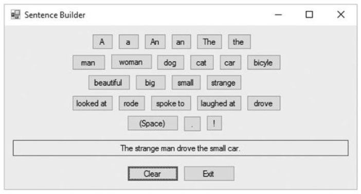

# Simple Sentence Builder Game

This repository contains a **Simple Sentence Builder Game**, developed using basic C#. The game is a fun and educational tool designed to help users practice sentence construction while demonstrating fundamental C# programming concepts.

## About the Project

The **Simple Sentence Builder Game** was created to:
- Help users practice constructing meaningful sentences from scrambled words.
- Serve as a beginner-friendly project showcasing basic C# programming techniques.
- Provide an engaging, console-based gaming experience.

## Features
- **Interactive Gameplay**:
  - Players are presented with a scrambled sentence.
  - Players need to arrange the words into a meaningful sentence.
- **Simple UI**:
  - Console-based interface for easy interaction.
- **Randomized Challenges**:
  - Scrambled words are randomized for replayability.
- **Scoring System**:
  - Tracks the number of correct and incorrect attempts.

## What I Did
- **Game Logic**:
  - Developed logic for presenting scrambled words and validating the user’s input.
- **User Interaction**:
  - Utilized console input/output for user engagement.
- **Randomization**:
  - Used C# libraries to shuffle words in sentences dynamically.
- **Error Handling**:
  - Added validation to handle incorrect inputs gracefully.

## What I Learned
- Practiced implementing game loops and logic in C#.
- Enhanced understanding of string manipulation and array handling.
- Gained experience in using randomization functions for dynamic content generation.
- Learned to structure simple C# console applications for clarity and efficiency.

## Technologies Used
- **C#**
- **.NET Framework**

## Screenshots




## How to Run
1. Clone the repository:
   ```bash
   git clone https://github.com/Raf1dhasan/Simple-sentence-builder-game.git
